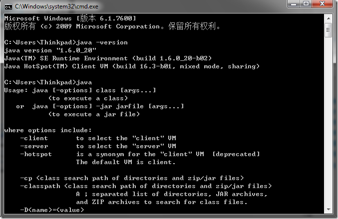

#新生群小课堂 知识总结（二）
来自Lulu学姐的整理和补充～请先移步阅读完（一）再看（二）哟～

这些都是真点儿零基础的内容，有不懂的尤其是**粗体字**请勤查搜索引擎^ ^ （（学姐是纯纯的文科生都可以理解，大家不要慌～

我们先来点轻松的话题，比如对某些日经问题的回答：

Q：粉红色的学长是谁？他是什么专业的？到底是学长还是学姐？

A：他是纯纯的真*学长，数学系，想要转计算机开发，也是个程序员，所以在这个工信群异常活跃。有时候有点可怕，但总的来说是一个好学的萌萌的学长，大家不要欺负他^ ^

Q：Lulu你是啥专业的？为啥在这个群？
A：窝是广告的学姐！但是也写代码！想修贵计院的双学位，就跑来工信群混脸熟啦。

再介绍一下群里的一些大触：13-张海是资深JAVA程序员，一枚学霸，浙大有一个课表应用（现在有了好多功能扩展）求是潮Mobile的安卓版本是他的作品。14-孙耀珠学长和14-何宇学长分别来自求是计算机班和竺院混合班（专业是计算机科学与技术），也是非常厉害的人哟。15-森森……嗯不要问窝他是学长还是学弟……反正是一尊大神……膜0.0

**然后我们会在群里教学一点clojure的内容，想学习的请优先阅读关于jdk和clojure的部分。**

##1 正确的学习姿势
###1.1 网站-续I
ycombinator的[hacker news](https://news.ycombinator.com/)会讨论一些新潮的技术。
##2 语言及参考书-续I
###2.1 C++
C++是一门相对复杂的语言，但学过C再学这个会相对容易，因为基本的语法一样。

##3 编程方法
###3.1 递归-续I：用Haskell分解质因数
```
module Main where
  prime_factors :: Int -> [Int]

  prime_factors 1 = []
  prime_factors n
    | factors == [] = [n]
	| otherwise = factors ++ prime_factors (n `div` (head factors))
    where factors = take 1 $ filter (\x -> (n `mod` x) == 0) [2 .. n-1]

  main = print(prime_factors 105)
```
下面提供解析（首先你应该阅读过（一）中关于Haskell的内容哦）：
####词
`take `

`filter`

`$` 函数的应用，可以不管

`div` 除

`mod`取余，例如7 mod 2 = 1,5 mod 3 =2

####句
`prime_factors 1 = []`表示对于数1，返回空列表（因为1没有质因数）。

`prime_factors n`及以下是一整个模块，对不等于1的n求质因数；这一行表示传入参数n。

- 先看最后一行：
	- ```(\x -> (n `mod` x) == 0)```一个匿名函数，输入x，给出n mod x 是否为0，即判断x 是否能够整除 n ；
	- `filter`表示过滤，`filter f l`表示从l中过滤，取出满足f的结果；
	- 因此```filter (\x -> (n `mod` x) == 0) [2 .. n-1]```就是，对于数n，依次输入2~n-1，从中取出能够整除n的数，形成一个新的列表。
	- `take n l`就是从l中取出前n个元素形成一个新的列表；
	- 因此```take 1 $ filter (\x -> (n `mod` x) == 0) [2 .. n-1]```即对于数n，取出2～n-1中能够整除n的最小数，即它的最小质因数。
    	- 这就是最后一整行的意思，即对于传入的参数n，取得它除自身以外的最小质因数，形成factors也就是这个最小质因数构成的单元素列表。
- 再看上面两行：
	- 第一个条件判断，`factors == [] = [n]`，是说，如果factors为空，那么数n在2～n-1之间没有质因数，那么它是素数，n的分解就是n，直接返回[n]，也就是由n构成的列表（其质因数只有其本身）。
	- `otherwise`当factors非空时，进行下面的运算：
		- `head l`是取出l中的第一个元素，`head factors`就是将factors这个单元素列表中的最小质因数取出来，把它变成一个整数；
		- 因此```prime_factors (n `div` (head factors))```就是n/最小质因数，然后调用函数自身，对它做一样的工作；
		- ```factors ++ prime_factors (n `div` (head factors))```就是将后面这个函数得到的结果加到列表factors中，最后就得到了一个将n分解质因数之后的因子列表。

这是一段完整的小程序，编译执行可以得到105的分解质因数结果`[3,5,7]`。
##4 笔记本-续I
###4.1 系统
之前我们在（一）中提到，Linux和OS X具有更好的开发环境。

这两者是类UNIX或UNIX的系统，它们的命令行**Shell**较为健全，对于开发工作来说比较方便。

在购机选择上，一些学长较为推荐RMBP即MacBook Pro with Retina display，即因为它有比较好的命令行**终端**，图形界面也比较良好，还具有较好的用户体验（自动保存），续航久，搜索工具便捷等。Retina屏幕则能够提供比较好的视觉体验。

关于OS X的使用可以参见学长的知乎回答：

[学生应如何充分利用 MacBook Pro？](http://www.zhihu.com/question/23250852/answer/24148131)
[OS X上有哪些优质的app？](http://www.zhihu.com/question/31782850/answer/53736877)
###4.2 配置
对于课程要求来说，电脑的配置在中等或中上就够了。

对于电脑的运行速度来说，硬盘很重要，可以考虑配一块**SSD**。
##5 正则表达式
在编写处理字符串的程序或网页时，经常会有查找符合某些复杂规则的字符串的需要。正则表达式就是用于描述这些规则的工具。换句话说，正则表达式就是记录文本规则的代码。正则表达式就是用于描述这些规则的工具。换句话说，正则表达式就是记录文本规则的代码。

正则表达式在编程中是重要的工具，学习起来的话，开始可能有点难以理解，但总体来说上手还是比较快的。

经典的教程有：
- [正则表达式30分钟入门教程](http://www.cnblogs.com/deerchao/archive/2006/08/24/zhengzhe30fengzhongjiaocheng.html)

这样子就不用管群里错过的正则教学啦，看这个教程，有问题提出就可以了。

在线练习可以去：https://regex101.com/

另外可以在各种支持正则表达式的编辑器里匹配你的文本来玩一玩，比如Sublime：
- [下载地址](http://www.sublimetext.com/3)

（注意选择和自己系统匹配的版本哦）

再给大家提供一个[速查表](http://www.css119.com/book/RegExp/)。

##6 JVM
即Java虚拟机（Java Virtual Machine，缩写为JVM），一种能够运行**Java bytecode**的**虚拟机**，是Java平台的一部分，能够运行以Java语言写作的软件程序。

Java虚拟机有自己完善的硬件架构，如**处理器、堆栈、寄存器**等，还具有相应的指令系统。JVM屏蔽了与具体操作系统平台相关的信息，使得Java程序只需生成在Java虚拟机上运行的目标代码（字节码），就可以在多种平台上不加修改地运行。通过对中央处理器（CPU）所执行的软件实作，实现能执行编译过的Java程序码（Applet与应用程序）。

作为一种编程语言的虚拟机，实际上不只是专用于Java语言，只要生成的编译文件符合JVM对载入编译文件格式要求，任何语言都可以由JVM编译运行。

我们提到过的原生在JVM运行的语言还有Clojure和Scala。
###6.1 JRE
这是JAVA Runtime Environment的简称，即JAVA运行环境，其内部有JVM，使得JAVA程序得以运行。
###6.2 JDK及其安装和配置
Java Development Kit（JDK）是一个免费软件开发工具包（SDK，Software development kit），也包含了JRE。开发原生在JVM上运行的语言程序，需要安装JDK。

下面简单介绍一下JDK的安装和配置。
- [下载地址](
http://www.oracle.com/technetwork/java/javase/downloads/jdk8-downloads-2133151.html)
- 首先点击选择Accept License Agreement，然后在下方的软件列表中选择你的系统对应的JDK版本（是上面那个软件列表的.exe文件哦）的链接，下载
- for windows：
	- 下载以后一路下一步安装，记一下安装路径；
	- 安装完了以后，在我的电脑-属性-高级-环境变量中设置：
		- JAVA_HOME：如果没有就新建一个环境变量，然后填入你的jdk的安装路径，形式类似`C:\Program Files\jdk`（注意我这个路径只是拿来举例子的，请填写你自己的安装路径；
		- path：这个变量一般是已经存在的，在已有的文本后用英文分号`;`分隔，然后填上路径\bin，形式类似`C:\Program Files\jdk\bin`
		- CLASSPATH：这个路径有可能不存在，那就新建，然后填入.路径\lib，形式类似`.;C:\Program Files\jdk\lib`；
		- 保存，确定。
		- 检验JDK是否安装成功：
			1. 打开cmd，一般是快捷键win+R，然后在出来的小窗口中键入cmd，回车，就会出现命令行界面；
			2. 依次输入`java`回车，`javac`回车，`java -version`回车，然后会返回类似下图。没有报错并且有反应，则安装成功。
			
			
再次强调注意环境变量的配置三点（%JAVA_HOME%指的就是jdk的路径）：
- CLASSPATH   .;%JAVA_HOME%\lib;                 （注意：前面点号，分号，后面分号）
- JAVA_HOME   C:\Program Files\Java\jdk1.6.0_17   (注意：前后均无符号)
- Path        %JAVA_HOME%\bin;              (注意：写在原来变量值的最前面  前无符号，后为分号)

##7 Clojure的简单学习

###7.1 安装
去群文件下载clojure然后解压到一个目录（最好是C盘），找到clojure1-7.0.jar的路径并记住这个路径；

打开cmd，输入`java -cp "clojure-1.7.0.jar的路径" clojure.main`回车，就可以运行Clojure。
###7.2 第一个问题：实现正整数的整除
目前在clojure中直接使用除法`(\ a b)`，即a\b，结果是一个分数，所以我们需要自己实现一个整除的函数。实现类似于10\2=5，10\3=3的整除效果。

一个原始的解决方案：
```
(defn divv [x y z] (if (< x y) z (divv (- x y) y (+ z 1))))
(defn div [x y] (divv x y 0))
```
我们把它格式化，得到：
```
(defn divv [x y z]
	(if (< x y)
		z
		(divv (- x y) y (+ z 1))
	)
)
（defn div [x y]
	(divv x y 0)
）
```
解析：
第一个函数：
- 第一行传入参数，x，y，z；
- (if …)是一个条件判断：
	- 当x < y，返回的结果即为Z；
	- 当x >= y,调用divv函数自身，三个参数分别是x-y，y，z+1；
	- 举例：(divv 10 3 0 )= (divv 7 3 1)=(divv 4 3 2)=(divv1 3 3).最后一个3就是10\3的整除的商。
第二个函数：
- 因为我们实际上是需要x\y的商，因此我们传入参数x，y，结果的产生则去调用已定义的函数divv，并将其参数设为x，y，0，这样就能得到x\y的结果。

定义了这两个函数以后，运行`(div 10 3)`，调用这两个函数，就可以得到10\3的结果3。
##8 软件
###8.1 MacType
微软的字体渲染有些糟糕，可以考虑去下一个MacType，就可以用Mac的方式渲染字体了，拯救你的眼睛。
###8.2 迅雷
提高下载速度的利器。
##8. 其他
###8.2 .NET框架（英语：.NET Framework）
由微软开发，一个致力于敏捷软件开发、快速应用开发、平台无关性和网络透明化的软件开发平台。是以一种采用系统虚拟机运行的编程平台，以通用语言运行库为基础，支持多种语言（C#、F#、VB.NET、C++、Python等）的开发。

可以参考JDK、JRE来理解它。
