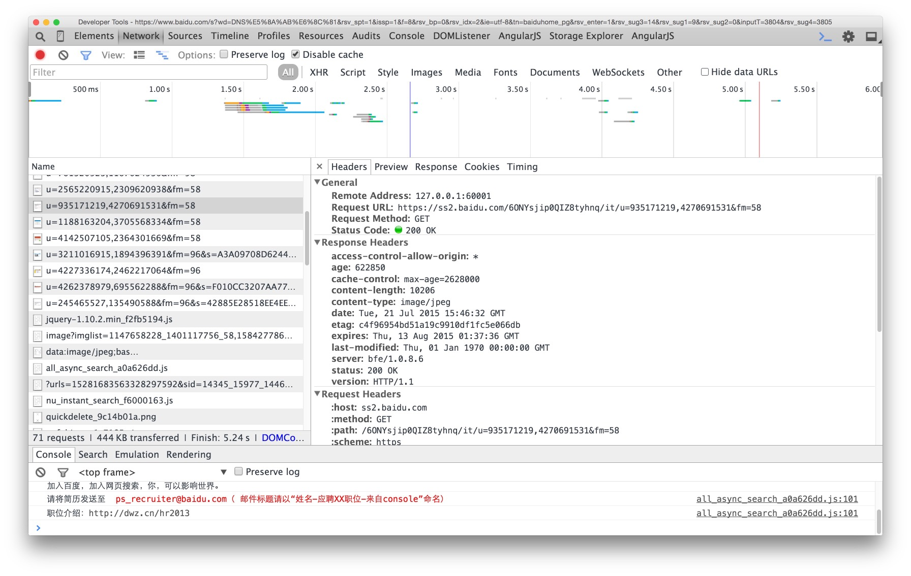
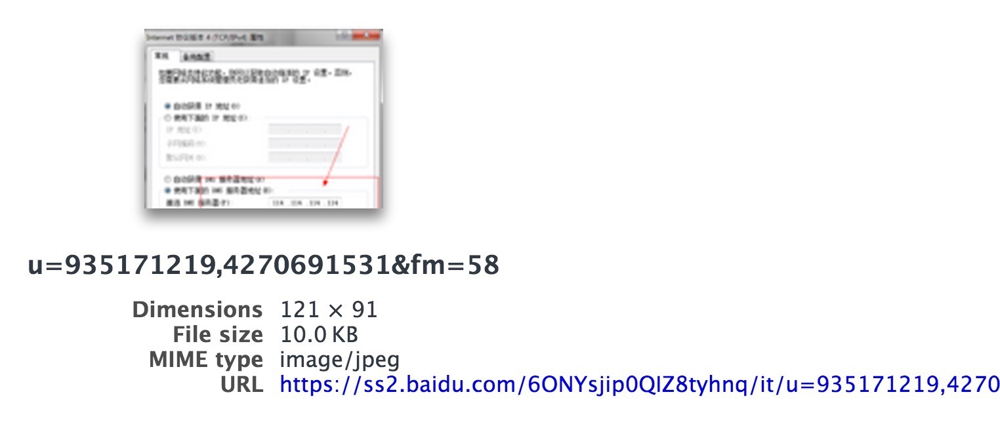
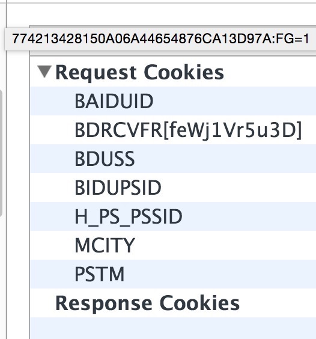

#小课堂专题篇0-访问网页的时候发送了啥
整理自7月21日23:30起至7月22日3:00的群记录。

来自Lulu的整理和补充～（和虎虎的教学～

**勤查粗体字，涨姿势更快哦～**

**勤查粗体字，涨姿势更快哦～**

**勤查粗体字，涨姿势更快哦～**

>大家都在上网，每天浏览着形形色色的网页，但你知道网页是如何生成的吗？当你访问网页的时候，实际发生了什么？

让我们来回顾一下这个过程。

有一天，虎虎想要上知乎http://www.zhihu.com 浏览一个大新闻，首先他在浏览器的地址栏输入了一个地址，但事实上，在他还没有输完地址的时候，浏览器就会开始预测这个地址。

如果你有chrome，可以到`chrome://predictors/`页面查看域名输入的统计数据。

我们可以看几张截图（来自虎虎的predictors）：
- 第一个数字是点击次数（Hit Count），第二个数字是错误次数（Miss Count），第三个数字是准确率（Confidence）


（哇学长真是一个知乎重度（中毒）用户……哇虽然窝好像也是……哇同学们可以去注册一个知乎然而好像和码代码没什么关系对不起窝跑题了窝回来QwQ）

`z`字头，知乎的匹配准确率高达73.5%，所以呢，当虎虎在浏览器地址栏输入`z`，浏览器就会开始预加载知乎网。这样，我们（感觉上的）网页加载速度就提高了。（这是Google Chrome浏览器的**Omnibox**技术，泥萌可以查查看嗷）

但事实上，不通过浏览器也可以上网，网络并不依赖于浏览器存在，例如网游实际上就没有浏览器，但都有网络请求。
但是你可能产生这样一个疑问：没有浏览器，怎么显示网页呢？

噗，我们可以把网页下载下来，然后在具有网页查看功能的软件里打开，比如Microsoft Word（听起来好丧病啊）。
你还可以使用**telnet**。

然后我们来看虎虎输入的这个地址，`zhihu.com`。这是一个**域名**，会被映射到一个**IP地址**，这就是**DNS**（Domain Name System 域名系统）服务。而**DNS劫持**（万恶的墙就和它有关哦），就是把域名解析到错误的IP，或者不解析。

然后大家会注意到很多时候网址都带着`http`或者`https`这样的东西。它们都是**网络传输协议**。

我们一般用的是**`HTTP`或`HTTPS`协议**。一个协议是一种信息的组织方式。我们可以在浏览器中使用快捷键F12查看自己发送和收到的HTTP请求。
- 在Chrome浏览器中，查看headers的方法是：
	- 打开一个网页，F12打开开发者工具；
	- 选择Network标签，然后刷新网页
	- 在左侧可以看到网页的**URL**，点击以后就能在右边看到headers

（其他浏览器的查看方法可以自己摸索^ ^或者自己查）

 我们可以来几张截图，看HTTP **headers**，每个HTTP请求，除内容外，还要额外接收和发送这些东西：


- 例如，以下是一个GET请求，你逐条去读，可以看到host、path的信息，然后方法是GET（它是GET请求嘛），它使用HTTP1.1版本的协议，接收了这些内容、编码、语言等等，不缓存（no-cache），有这些cookies，referer表示你从哪里来到这个页面，user-agent显示你的客户端信息（用了什么浏览器等等），

**而内容的主体是它，path，是这个请求在求的东西或者说要告诉对方的事情**


HTTP请求的header，由发送者制造，接收者都可以知道。

根据这些信息，可以做很多事情。例如：
- 通过过滤掉非法的user-agent，过滤掉比较渣的**爬虫**；
- 过滤referer防止**盗链**；
- ……

此外，从google链接到百度网盘无法打开，因为referer是google，会被百度恶意重定向到网盘首页。
浏览器也会通过headers做一些事，比如缓存策略。

 除了headers，还有**cookies**：



但是cookies的值（value）不可以泄露哦。因为它保存了验证的内容，手动设置别人的cookie，有时可以用别人的身份登录。此外，HTTP的cookie传输是**明文**的，十分不安全。所以一般会采取加密的HTTPS，以及将cookie内容做成与设备、浏览器、IP等信息有关的方法。cookies是什么，哪里看，可以自己查一查。

我们可以继续看这张图：


虎虎打开一个网页时，发送请求，请求有host和path，发送请求时，会解析host，解析到一个IP，然后发数据包。

网络协议是一层包一层的，HTTP是上层协议，有header，IP也有IP的header。HTTP<-**TCP**<-IP<-**，每一层都包了自己的header，然后在网络中传播，然后接收者收到以后，再一层层解包。最外层的header在物理层。

假如把文本理解为信息，我们把它封装为txt文件，然后txt文件被封装为http包裹；图片，可以认为其中原始的信息是最根本的内容，jpg图片里也有一些header，还有压缩的信息等。jpg图片也是有header的，header不对就不能显示，哪怕内部信息是正确的。

大部分时候，包无法定向发送，而是发给网络的所有人，大家收到了，再根据header判断是不是送给自己的，不是就扔掉。因此有很多中间点，进行检查过滤，转发等等，否则全世界的终端都在一个网络，这是不可能的；路由器就具备这种中间点的功能，它的内部有芯片，芯片可以算是物理层的。

我们假装已经理解了上面的内容（……），此时虎虎的包就发出去了，对方的服务器也收到了，然后传给了监听的程序，一般是**apache**或者**nginx**。操作系统有端口，监听一个端口，就是接收这个端口的信息，不然你的包会被对方服务器的操作系统拒绝。监听的端口都是绑定到文件夹的。有程序在监听，虎虎的包发到了对方的服务器，对方很快就会发给他需要的信息。

我们举例提到了apache、nginx，实际上我们不一定都要用他们，甚至可以写程序自己监听。当然使用apache和nginx是因为比较专业。实际上很多语言都有简单地建立一个http服务器的功能，比如**python、ruby**，而不需要nginx等。比如`python -m SimpleHTTPServer 8080`，nginx也是类似这样的代码，但它是用C写的，并且有很多行，而这里python只有一行。

我们注意到之前有一个path，就是`:path:  /60NYsjip0QIZ8t……`这段，那么，假如服务器的80端口绑定到`～/www`文件夹，服务器接收到虎虎的请求以后，就会去找`～/www/60NYsjip0QIZ8t……`。这只是基本的理解，实际上很可能并非如此，因为这个参数可以被转发，比如转发给第三方应用程序，如php，然后再从这个path中取得一些信息，运行一些程序。信息总是在被转发的。然后php会运行，返回一个字符串什么的（不一定是字符串，其实什么都可以，这里打个比方）。

注意，第三方应用程序是在对方服务器上的，转发给它是为了处理数据，因为apache和nginx自己没有处理功能；而虎虎发请求是为了得到他想要看的网页，对方的服务器要根据他的请求来生成一些东西，这一般是通过第三方程序生成。第三方程序不一定要php，也可以自己写一个，自己处理。

来个栗子（这是ruby这门语言写的）：
```
require 'sinatra'

get '/hi' do
	"Hello World"
end
```

它所做的事情就是，请求`sinatra`这个包，当path是`/hi`的时候，返回`Hello World`这个字符串。这就是一个简单的第三方程序。

我们平时说的写网站，关键就是这个第三方程序，不同的网页之所以不一样，就是这个程序不同，它可能很复杂，还需要和其他程序如数据库进行交互，此外还可以做很多优化。

服务器生成了这些东西以后，会以同样的过程包回去，再把这些包发回给虎虎。这个时候浏览器就会收到很多包裹，里面可能有HTML/CSS/Javascript字符串，也有图片、视频等等资源。浏览器的功能，除了发请求外，还有渲染接收到的东西。浏览器根据这些资源，可以排出一个网页，比如其中的HTML就能够指定网页元素的结构，CSS可以指定样式，Javascript可以创造动画效果等。但这些东西不是浏览器生成的，它只是渲染，它自身是无法接收一些内容然后根据这些内容来生成待渲染的东西的。

在生产实际中，服务器可能不止一台，nginx之类的程序和第三方程序不在一台电脑上，那么就还需要进行跨主机转发。

然后虎虎就得到了这个网页，我们也就讲得差不多了。

有没有觉得我比他说得好理解多了2333……

为了更方便理解，我把他那个做菜的比喻也放上来。我觉得我妈都能看懂了你们再看不懂我跟他都要报警了……

总之呢，这一整个过程，就好比：
- 虎虎要吃ABC餐馆（服务器）的FDS菜，但是他只有做菜机（浏览器），然后他包了一层，包了一个空的包裹（因为GET请求是没有内容（实质的内容）的）在包裹上写，“我要吃ABC餐馆的FDS菜”；
- 做菜机研究了一下，发现餐馆在某市某街某号，做菜机又包了一层，写上，“给某市某街某号”；
- 这里，path就是FDS菜（其实窝觉得确切说来是菜单或者菜品名一样的东西……菜还没做呢），做菜机包的那层是IP，虎虎自己包的那层是HTTP；
- 稍微简化一下，先不管其他还有各种层，假设我们的网络可以直接发IP包，然后某地的餐馆收到了这个包裹，知道是给自己的，因为地址是自己的，它就把包裹拆了，然后包裹只剩下一层，上面写着“我要吃ABC餐馆的FDS菜”；
- 这个时候餐馆就转发给处理FDS菜的人（第三方应用程序），然后返回菜谱和食材；
- 然后虎虎的做菜机用一样的方式接收，解包，得到菜谱，根据菜谱和食材做了菜；
- 实际中，菜谱是（HTML+CSS+Javascript），食材就是资源比如图片等。


