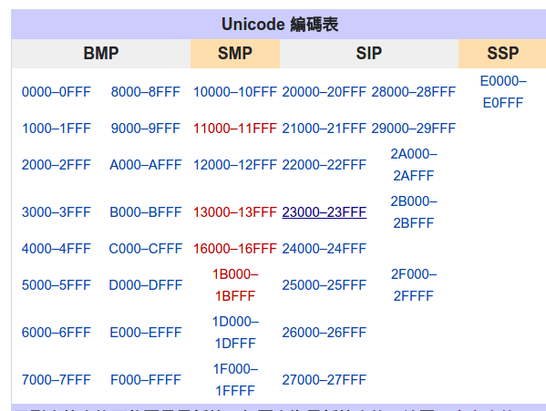

#小课堂专题篇2-字符编码的故事
本篇写作来自Lulu～> <～

前几天有一些同学碰到了字符乱码的问题，我们通过调整编码模式解决了，所以它的原理是什么呢？

为了写出能够在非英语环境也还是正常工作的代码，我们需要对字符编码、字符集有一定的了解。
##从ASCII码开始
我们不会去谈特别古老的字符集，例如EBCDIC什么的，回到一般远就够了，比如ASCII码。

计算机一开始被用来解决数字计算的问题，但后来，它开始处理更多的东西，例如文本。但是计算机只认识“数”，所以我们就用数字来表示特定字符，例如65表示`A`，66表示`B`，等等。为了让同样的数字在不同计算机上能够表示一样的字符，我们需要确立计算机中数字-字符的对应关系，因此，美国国家标准协会ANSI就制定了一套标准，规定常用字符的集合以及每个字符对应的编号，即ASCII字符集，也叫ASCII码。

在Unix刚出来，K&R写出《The C programming language》的时代，事情如此简单。我们暂时只需要表示不带重音的英文字母、数字和其他一些常用符号，ASCII完全可以胜任。ASCII码用32到126表示可显示字符，包括空格、英文字母、阿拉伯数字、标点符号、运算符号等，0~31及127则表示控制字符或通信专用字符，例如8表示退格，18表示取消。使用7比特就可以高效地存储和处理这些字符。而当时的计算机普遍使用**8比特字节**作为最小的存储和处理单元，不仅可以存储所有的ASCII码，还有一个比特多出来干其他事。标准ASCII码（基础ASCII码）中，最高位1比特被用作一些通信系统的奇偶校验。
> 题外话：字节表示系统能够处理的最小单位，不一定是8比特。但现代计算机的事实标准是用8比特表示1字节，在技术规格文献中，为避免歧义，常常用8位组（Octet）而不是字节来强调8个比特的二进制流。但这里我们仍然沿用大家熟悉的“字节”概念。

那个时候的字符编解码系统，就是简单的查表过程。将字符序列编码为二进制写入设备，只需要在ASCII字符集中依次找到字符对应的字节，写入存储设备即可；解码二进制流的过程也是类似的。

假如你生在英语国家，那么一切看起来十分美好。

##OEM字符集
1字节有8比特，但我们只用了7个，而且随着计算机的发展，ASCII码可怜兮兮的128个字符不够用了，所以好多人都想用128-255的码字来表示其他东西。

IBM-PC上就多了一个叫OEM字符集的东西，例如欧洲语言中的重音字符，画图字符如水平线等等。然而事实是，当PC在美国以外的地方开始销售的时候，OEM字符集就完全乱套了，厂商们用自己的方式使用高128个码字，导致销往世界各地的机器上出现了各式各样的OEM字符集。

大部分OEM字符集的前128个字符兼容ASCII字符集（有时候前32个控制字符会被当做打印字符解释），但对后128个字符的解释却不一定相同。不同的OEM字符集使得人们无法跨机器交流各种文档。

最终ANSI标准结束了混乱。在标准中，对于低128个码字大家没有异议，差不多就是ASCII码，但对于高128个码字，则会根据所在地不同而有不同的处理方式。我们称这样相异的编码系统为码页。

在cmd中打开默认值设置，`选项`标签页中有一个设置字符编码的地方，它给出的属性就是`默认代码页`，比如我的Windows 7 给出的其值的选择就只有`437 (OEM - 美国)`和`(936 ANSI/OEM - 简体中文 GBK)`。

我们可以再举些栗子，在以色列发布的DOS中使用的码页是862，而在希腊使用的是737。MS-DOS的国际版中有很多这样的码页，涵盖各种语言。它们的低128个码字完全相同，再往上则大有不同。

这个时候，想让希伯来语和希腊语在一台计算机上和平共处，还是一件基本没可能的事情，除非我们自己写程序，显示部分直接使用位图，因为希伯来语对高128个码字的解释和希腊语完全不一样。

##多字节字符集和中文字符集
上面的字符集都是基于单字节编码，也就是一个字节翻译成一个字符，这对于拉丁语系的国家可能没什么问题。但在亚洲，疯狂的事情开始上演。亚洲的字符系统中可能有成百上千个字符，8个比特远远不够。这些地方为了使用电脑，并与ASCII字符集兼容，就发明了多字节编码方式，出现了多字节字符集。比如双字节字符集编码（DBCS，Double Byte Character Set）。

在DBCS中，有的字母用1字节表示，有的用2字节，所以处理字符串时，指针移到下一个字符比较容易，移到上一个字符就可能十分危险。因此s++或s--就不再被鼓励使用，相应的比如Windows下的AnsiNext和AnsiPrve被用来处理这种情况。

对于单字节字符集来说，代码页中只需要一张码表，上面记录着256个数字代表的字符，程序只需要做简单的查表就可以编解码。

但是多字节字符集的代码页可能有很多码表，程序要怎么知道使用哪张码表去解码二进制流呢？答案是根据第一个字节来选择不同的码表。

##ANSI标准、国家标准、ISO标准
不同字符集的出现使得文档交流十分困难，因而需要标准化。

举些栗子：
- 美国ANSI标准制定了ANSI标准字符编码（但我们日常说的ANSI编码，指的是平台的默认编码，例如英文操作系统中是ISO-8859-1，中文系统是GBK）；
- ISO组织制定了各种ISO标准字符码；
- 各国自己的国家标准字符集，中国有GBK，GB2312和GB18030等。

操作系统发布时，会往机器里预装标准字符集和平台专用字符集，这样，如果文档由标准字符集编写，通用性就比较高。例如GBK编写的文档在中国大陆内的任何机器上都能正确显示，同时，如果安装了相应的字符集，我们也可以在一台机器上阅读多个国家不同语言的文档。

##Unicode
互联网的出现，让字符串在计算机间移动变得十分普遍，事情变得更加棘手，Unicode应运而生。

通过使用不同字符集，我们可以在一台机器上查阅不通文档，但我们仍然无法在一份文档中显示所有的字符，这就需要一个全人类达成共识的巨大字符集，就是Unicode字符集。

###概述
维基百科这样描述Unicode：
>Unicode （統一碼、萬國碼、單一碼）是一种在计算机上使用的字符集。它为每种语言中的每个字符设定了统一而且唯一的二进制编码，以满足跨语言、跨平台进行文本转换、处理的要求。1990年开始研发，1994年正式公布。随着计算机工作能力的增强，Unicode也在面世以来的十多年裡得到普及。最新版本的 Unicode 是 2014年6月推出的Unicode 7.0。

让我们来看一张来自维基教科书的图片：

我们注意到上面有BMP、SMP这样的分类。Unicode用字符平面映射将Unicode字元分为17组编排，每组称为平面（Plane），而每平面拥有65536（即2^16）个代码点。然而目前只用了少数平面。BMP的含义是基本多文种平面，基本覆盖了当今世界用到的字符，其他平面则多表示远古文字或用作扩展。

关于字符平面映射的具体内容可以自己另外查，比如wiki什么的。

###码点
Unicode试图用一个字符集涵盖整个地球的书写系统，一些人误以为Unicode只是简单地使用16比特的码字，也就是说一个字符对应16比特，总共表示2^16也即65536个字符，这是不对的。

事实上Unicode使用一种和之前的字符集系统**不同**的思路来考虑字符。我们必须理解这种思路，否则就毫无意义。

在这之前，我们把一个字母映射到几个比特，这些比特可以存储在磁盘或内存中。例如：`A -> 0100 0001`。所有的字符集都和具体编码方案绑定，直接将字符和最终字节流绑死，编码系统通过查表，就可以将字符映射为存储设备上的字节流。但是，字符和字节流之间关系太过紧密，使得字符集的扩展能力受限。往现有字符集中加入新的字符，会很困难，甚至可能破坏现有的编码规则。Unicode在设计上考虑到了这一点，将字符集和字符编码方案分开。

Unicode就像一个电话本，标记着字符和数字之间的映射关系。在Unicode中，一个字母被映射到一个叫做码点（code point）的东西，它可以看做一个纯粹的逻辑概念。

也就是说，Unicode的字母A是一个纯抽象的概念，它跟a不一样，跟B不一样，但是Times New Roman的A和Helvetica的A是一样的（这是俩不同的英文字体），这个很好理解。但是一些语言中，如何辨别一个字母是存在争议的，比如德语中，β是一个完整字母，还是ss的花式写法？如果一个字母的形状因为它在单词末尾而有所改变，这还是原来的那个字母吗？阿拉伯人会说算了，希伯拉人可不这么想。机智的Unicode委员会解决了这些问题，尽管历经十多年的博弈，甚至是带有政治味道的。

每一个字母系统中的每一个这样的字母在Unicode中都被分配了一个数字，总是用`U+`开头，例如`U+0639`，这个就是码点。U+的意思就是Unicode，数字是16进制。`U+0639`表示阿拉伯字母Ain。我们可以使用系统自带的字符表功能或者[Unicode官网](http://www.unicode.org)来查找码点和字母的对应关系。

Unicode并不涉及字符是怎么在字节中表示的，它仅仅指定了字符对应的数字，仅此而已。

事实上Unicode可以定义的字符数并没有上限，而且现在已经超过了65536，并不是任何Unicode字符都能用2字节表示了。

记住，Unicode只是一个用来映射字符和数字的标准。它对支持字符的数量没有限制，也不要求字符必须占两个、三个或者其它任意数量的字节。

Unicode字符是怎样被编码成内存中的字节这是另外的话题，它是被UTF(Unicode Transformation Formats)定义的。
###编码
讲到这里，我们至少需要明白三件事：
1. 纯文本一开始是不存在的，读出一段字符串，必须知道它的编码方式。
2. Unicode是一个标准，把字符映射到数字，其背后的问题由Unicode协会处理，例如为新字符指定编码等；所有字符在Unicode里都有对应的映射，每个映射称为码点（code point）。
3. Unicode不指定字符编码成字节的方式，这是被编码方案也就是UTF（ Unicode Transformation Format）决定的。

计算机的二进制流是这样变成屏幕上的字符的：
- 二进制流->根据编码方式解码出码点->根据Unicode码点解释出字符->系统渲染绘出这个字符

而文本字符则是这样存储到计算机上的：
- 输入字符->根据字符找到对应码点->根据编码方式把码点编码成二进制流->存储二进制流到计算机

###UTF
我们可以来看几个流行的Unicode编码方案，比如UTF-8和UTF-16，来了解Unicode编码的细节。
####UTF-16
Unicode最早的编码想法，是把每个码点存储在两个字节中。

例如实现BMP（基本多文种平面）字符，由于BMP层面上有2^16=65536个字符，因此只需要两个字节就可以完全表示它们。

UCS-2和UTF-16对于BMP平面的字符都使用两个字节表示，并且结果一致。它们的区别是，UCS-2最初设计的时候只考虑BMP字符，使用固定2个字节长度，因而无法表示Unicode其他平面的字符；而UTF-16支持Unicode全字符集的编码，采用变长编码，最少使用两个字节，对BMP以外的字符，则需要四个字节。

> Windows很早就开始采用UTF-16编码。许多编程平台如Java等也使用它作为基础的字符编码。

但这样意味着一些字符所占的空间翻倍，例如英文字母的码点不超过`U+00FF`，前面这些零实际上浪费了存储空间。并且之前还有大量已经使用了ANSI和DBCS字符集的文档，难道要转换它们吗？
####UTF-8
于是UTF-8出现了。这是一个漂亮的概念。它用来存储字符串所对应的Unicode码点，并且存储的最小单元是8比特字节。

在UTF-8中，0~127号码字用1个字节存储，使用和US-ASCII相同的编码。这样就实现了对ASCII码的向后兼容，以便Unicode被大众接受。而超过128的码字，则使用2个，3个甚至4个字节来存储。因此UTF-8被称为可变长度编码。

此外，为了区别Unicode和ASCII，区分三个字节表示的是一个符号还是三个符号，UTF-8还有如下的编码规则：
- 对于单子节字符，第一位为0，后7位为Unicode码；因此其UTF-8编码和ASCII码相同。
- 对于n字节字符（n>1），第一个字节的前n位都为1，第n+1位设为0，后面字节的前两位都设为10；剩下的二进制位，则是这个字符的Unicode码。

####GB18030
任何能将Unicode字符映射为字节流的编码都属于Unicode编码。GB18030是中国的字符编码，覆盖了Unicode的字符，也是Unicode编码。但它的编码并不像UTF-8那样，将字符的编码通过一定规则转换，而是通过查表来编码。

####大小端
即Big Endian和Little  Endian，说法源自格列佛游记，鸡蛋一端大一端小，小人国的人们对于剥蛋壳时应从哪一端开始剥起有着不一样的看法。

类似的，计算机界对于传输多字节字时，是使用高字节序（大端）还是低字节序，也有不同看法。

写入文件或网络传输，都有往流设备进行写操作的过程，它从流的低地址向高地址写。
高字节序先写入高位字节，低地址存储最高有效字符；低字节序先写入低位字节，低地址存储最低有效字符。

低字节序和高字节序都只是关于如何存储和读取一段字节的约定。一般来说，网络协议用大端模式传输。
####猜测编码
我们已经知道了不存在纯文本，但程序通常能够正确地显示内容，是因为例如文本编辑器和浏览器等，能够猜测编码。但出于效率的考虑，一般是提取字节流前面的若干字节，检验是否符合一些常见字符编码的规则。

对于英文字母来说，因为它能够在大多数字符集中显示，即使猜错编码也没有关系；但有时候我们会看到`？`或`�`等，则说明其编
码不是程序猜测的那个，可以自己在相关设置中调整编码模式。
####BOM（字节顺序标记）
有时候我们会看到UTF-8和UTF-8 without BOM的区分。后者指字节流以BOM标记开始。BOM存放在文档开头，告诉程序阅读该文档的字节序。这样便于在高低字节序的系统间转换文档和区分字节序，提高猜测编码的准确性。

在UTF-16，它通过对于高低字节序，在第一个字节显示FF FE和FE FF实现，从而把文档的字节序告知解释器。

还有一个类似的概念，叫Magic Byte 魔术字，也被用来表明文件格式，它们的关系没有被清楚定义过，有的解释器会弄混。

需要注意的是并非所有程序都能正确处理BOM，例如PHP就不检测BOM，而是将其作为普通字节流解析，因此如果PHP文件采用带BOM标记的UTF-8编码，就可能出错。
##乱码问题
现在我们可以回到文章最开始提出的问题了。乱码是因为使用了错误的字符编码来解码字节流，所以我们必须搞清楚当前使用的字符编码是什么。

例如编写网页，就需要用Content-Type或meta charset标签来明确指出文档的编码，让浏览器不必猜测就可以使用指定的编码来渲染文档。此外，如果网页文件本身存储时使用的字符编码和网页声明的字符编码不一致，也可能乱码。

`？`或`�`就是程序使用特定字符编码解码时，无法解析某些字节流的替代字符。如果我们得到的文本包含这样的字符，又无法得到原始字节流，就会丢失正确信息，尝试任何字符编码都无法从中还原。

##参考文献
- [你真的理解编码吗？unicode，utf8，utf16详解](http://www.cnblogs.com/developerY/p/3575271.html)
- [关于字符编码，你所需要知道的](http://www.cnblogs.com/kevinyang/archive/2010/06/18/1760597.html)
- [关于字符集和Unicode的相关知识](http://www.sj33.cn/jc/wyjc/wyll/201003/22481.html)
- [字符编码(ASCII，Unicode和UTF-8) 和 大小端](http://www.cnblogs.com/skywang12345/p/3360348.html)
- [学点编码知识又不会死：Unicode的流言终结者和编码大揭秘](http://www.freebuf.com/articles/others-articles/25623.html)

